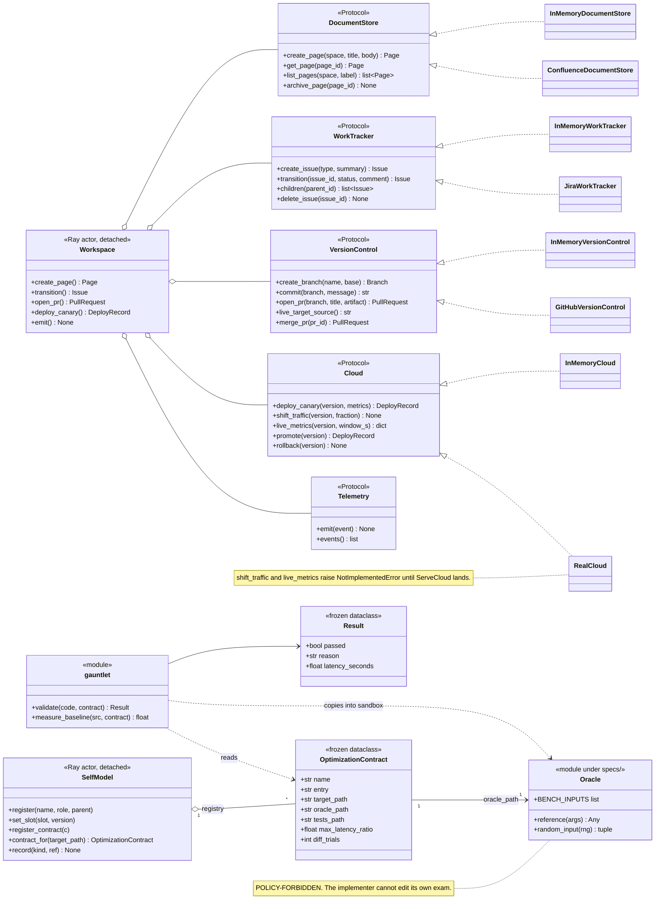
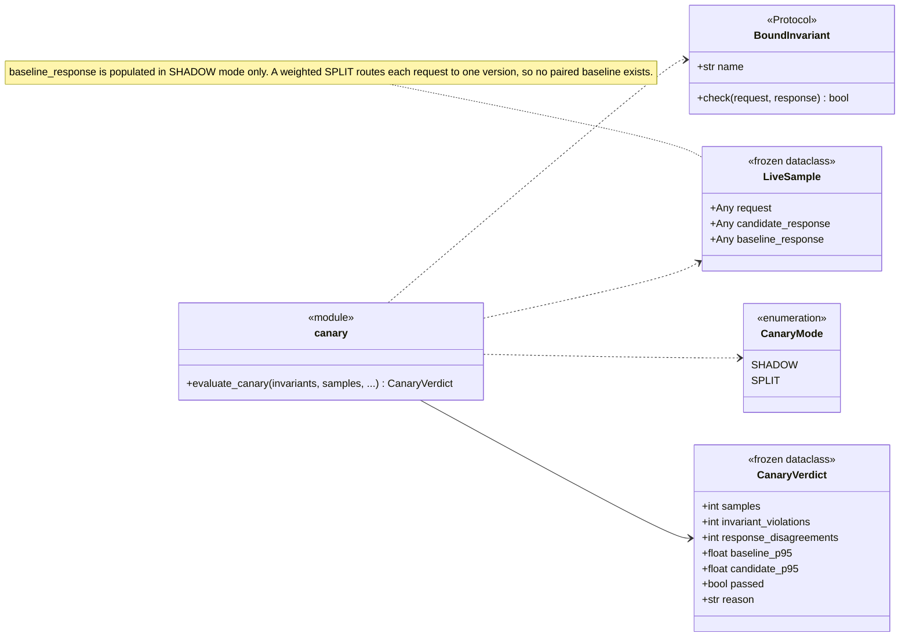
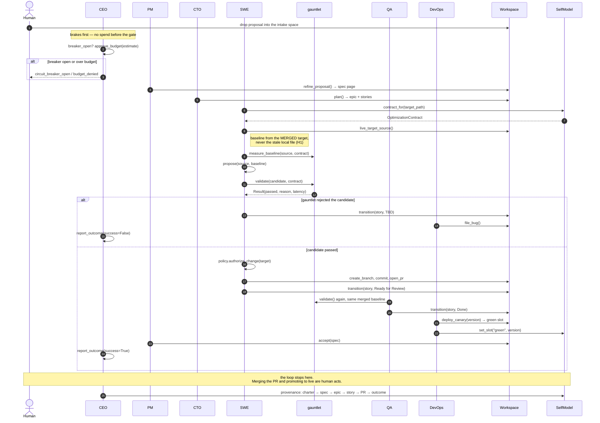
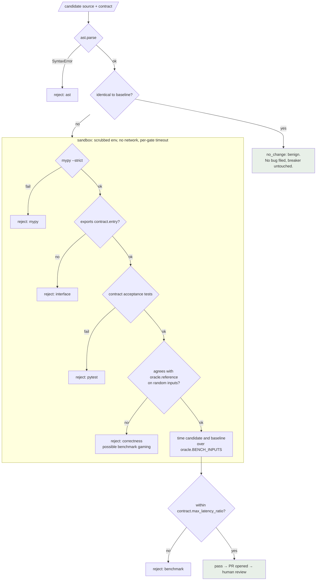
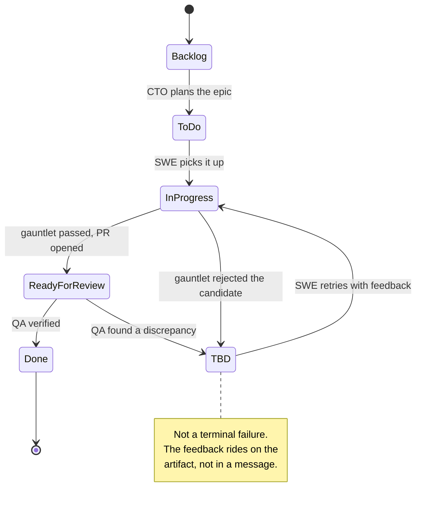
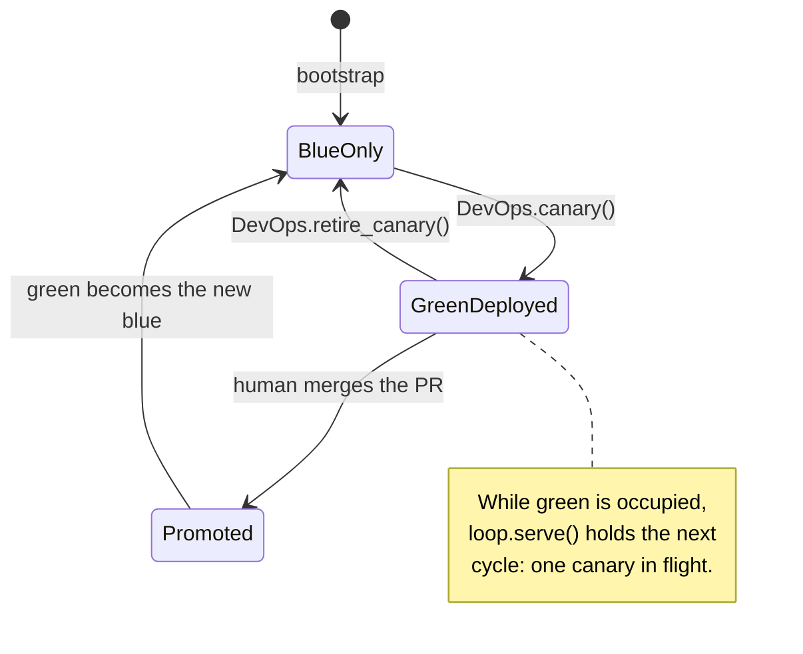

# Diagrams

UML views of omnibase, in Mermaid so they render wherever the markdown is read
and stay in the same commit as the code they describe. Prose lives in
[`ACTORS.md`](../ACTORS.md), [`DESIGN.md`](../DESIGN.md) and
[`CODE_TOUR.md`](CODE_TOUR.md); these are the pictures.

> Keep these honest. A diagram that drifts is worse than none, because it is
> believed. If you change a port, a gate, or a workflow state, change the
> diagram in the same PR.

Contents:
1. [Class — ports, adapters and the contract](#1-class--ports-adapters-and-the-contract)
2. [Sequence — one self-improvement cycle](#2-sequence--one-self-improvement-cycle)
3. [Activity — the validation gauntlet](#3-activity--the-validation-gauntlet)
4. [State — issue workflow and deploy slots](#4-state--issue-workflow-and-deploy-slots)

---

## 1. Class — ports, adapters and the contract

The hexagonal core. Every external capability is a `Protocol` in `sis/ports.py`
with two implementations: in-memory (the credential-free default) and real
(Confluence / Jira / GitHub / AWS). Roles never touch an adapter directly — they
go through the `Workspace` actor, which is the shared artifact bus.

The canary types are the online mirror of the same idea — the contract's
predicates, applied to live traffic instead of generated inputs:

---

## 2. Sequence — one self-improvement cycle

`org.run_cycle()`, the happy path. The point ACTORS.md makes in prose and this
makes visible: **roles do not chat.** Every handoff is a state change on a
durable artifact, which is simultaneously the work queue, the message bus and
the audit trail.

---

## 3. Activity — the validation gauntlet

`gauntlet.validate()`. Cheapest and safest checks first; the first failure
short-circuits, so an expensive gate never runs on a candidate a cheap one
already rejected. Everything inside the dashed boundary executes **candidate
code**, and therefore runs in the sandbox — never in the actor process, which
holds credentials.

Two cross-cutting protections wrap every gate that runs candidate code: the
sandbox (`SIS_SANDBOX=subprocess` by default, or kernel-enforced `docker` —
mandatory for a real LLM proposer) and a per-gate timeout, so an infinite loop
is killed rather than left to hang. A gate that *cannot run* — a missing oracle
or acceptance suite — fails closed with a `harness:` reason, so a broken harness
is never recorded as a verdict on the candidate.

---

## 4. State — issue workflow and deploy slots

**Issue lifecycle** (`sis.ports.IssueStatus`). QA bouncing a story to `TBD`
rather than failing it outright is what makes the SWE↔QA loop an artifact
exchange instead of a conversation.

**Deploy slots** (`SelfModel._slots`). Blue is live, green is the canary. The
loop can put a candidate in green; only a human can make it blue.

> **Known gap:** nothing observes the human merge today, so the
> `GreenDeployed → Promoted` transition has no automatic trigger — `merge_pr`
> raises `RequiresHumanApproval` in every adapter and there is no post-merge
> path. Tracked as an open problem in [`SERVE_CANARY.md`](SERVE_CANARY.md).
